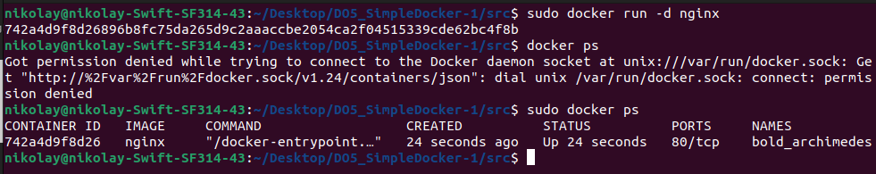
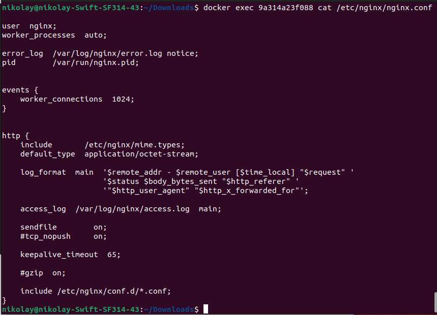

# REPORT Simple Docker

## Part I

- Взять официальный докер образ с **nginx** и выкачать его при помощи `docker pull`

 
<i>команда docker pull nginx</i>

- Проверить наличие докер образа через `docker images`

 
<i>docker images</i>

- Запустить докер образ через `docker run -d [image_id|repository]`
- Проверить, что образ запустился через `docker ps`

 
<i>команда docker run -d и docker ps</i>

- Посмотреть информацию о контейнере через `docker inspect [container_id|container_name]`

 
<i>команда docker inspect  bold_arcmimedes</i>

- По выводу команды определить и поместить в отчёт размер контейнера, список замапленных портов и ip контейнера

 
<i>команда docker inspect c выводом форматируемой строки нужной информации</i>

- Остановить докер образ через `docker stop [container_id|container_name]`
- Проверить, что образ остановился через `docker ps`

 
<i>команда docker stop bold_archimedes и docker ps</i>

- Запустить докер с замапленными портами 80 и 443 на локальную машину через команду run

 
<i>команда docker run -dp 80:80 -p 443:443 --name huinya nginx и docker ps</i>

- Проверить, что в браузере по адресу localhost:80 доступна стартовая страница nginx

 
<i>вывод localhost:80 в браузере</i>

- Перезапустить докер контейнер через `docker restart [container_id|container_name]` и проверить что докер запустился

 
<i>команда docker restart huinya, docker ps и браузер</i>

## Part II

- Прочитать конфигурационный файл *nginx.conf* внутри докер контейнера через команду *exec*

 
<i>вывод содержимого файла nginx.conf</i>

- Создать на локальной машине файл nginx.conf
- Настроить в нем по пути /status отдачу страницы статуса сервера nginx

для этого создаем файл nginx.conf в папке `part_2` копируем содержимое файла из терминала прошлого файла, комментируем include, так как nginx берет другие файлы конфигурации, которые не позволяют корректно работать местоположению '/status' и добавляем отдачу страницы (http://nginx.org/en/docs/http/ngx_http_stub_status_module.html)

 
<i>файл nginx.conf на локальной машине</i>

- Скопировать созданный файл nginx.conf внутрь докер образа через команду docker cp
- Перезапустить nginx внутри докер образа через команду exec
- Проверить, что по адресу localhost:80/status отдается страничка со статусом сервера nginx

 
<i>сначала копируем измененый conf с локальной машины в докер образ, затем перезапускаем докер образ и проверяем что он выдает нужную информацию по заданому пути</i>

- Экспортировать контейнер в файл container.tar через команду export
- Остановить контейнер
- Удалить образ через docker rmi [image_id|repository], не удаляя перед этим контейнеры
- Удалить остановленный контейнер

 
<i>экспортируем контейнер, останавливаем и удаляем образ nginx и удаляем контейнер engin</i>

- Импортировать контейнер обратно через команду import

используем команду `import`при этом передаем в cmd так сказать стартовый параметр который должен запускаться после старта докера - "nginx" при этом обязательно надо укзать -g deamon off. после этой команды мы загрузили образ это можно увидеть командой images. Затем командой `run` запускаем контейнер на основе этого образа.

- Запустить импортированный контейнер

- Проверить, что по адресу localhost:80/status отдается страничка со статусом сервера nginx 

 
<i>загрузка образа в докер, запуск контейнера на базе образа, проверка контейнера </i>

## Part III

Здесь будем делать все на локальной машине согласно заданию.

- Написать мини сервер на **C** и **FastCgi**, который будет возвращать простейшую страничку с надписью `Hello World!`

`sudo apt install libfcgi-dev spawn-fgci` - установим библиотеку FastCgi и то что необходимо для компиляции сервера. Затем напишем минисервер.

 
<i>минисервер на **C** и **FastCgi** </i>

- Запустить написанный мини сервер через *spawn-fcgi* на порту 8080:

 
<i>компиляция и запуск минисервера </i>

- Написать свой *nginx.conf*, который будет проксировать все запросы с 81 порта на *127.0.0.1:8080*

`sudo apt install nginx` - устанавливаем на локальную машину nginx
пишем конфигурационый файл 

 
<i> конфигурационный файл nginx.conf </i>

- Проверить, что в браузере по *localhost:81* отдается написанная вами страничка

 
<i> проверка что наш сервер работает по порту 81 </i>

- Положить файл *nginx.conf* по пути *./nginx/nginx.conf* (это понадобится позже)

согласно задани и копируем его в /etc/nginx/ на локальной машине:
`cp nginx.conf /etc/nginx/`

## Part IV

Для этого задания необходимо минимум 4 файла, которые мы создадим:
- `mini_server.c` (непосредственно сервер, копируем из третьего задания)
- `nginx.conf` (конфигурационный файл с настройкой портов, который мы копирнем в докер образ)
- `run.sh` (описано что нужно делать контейнеру во время запуска)
- `Dockerfile` (будет содержать инструкции, по которым будет запускаться контейнер с образом `nginx`)

1) мини сервера на FastCgi  просто выводит фразу: `Hello world!` (взят из третьего задания):

 
<i> mimi_server.c </i>

2) конфигурационный файл nginx